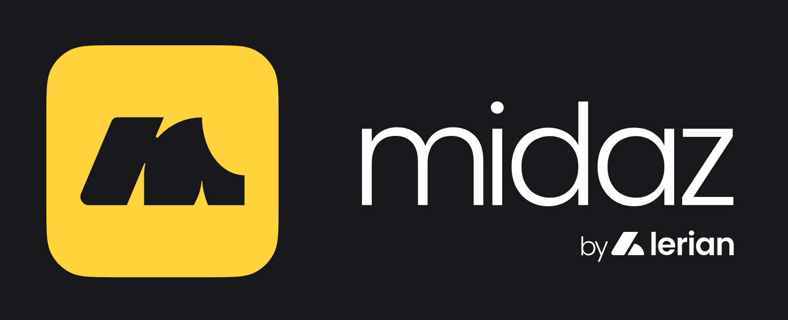

<div align="center">

[](https://github.com/LerianStudio/midaz-stack/releases)
[](https://github.com/LerianStudio/midaz-stack/blob/main/LICENSE)
[](https://discord.gg/DnhqKwkGv3)

</div>

# Midaz Stack: All-in-One Suite

Midaz Stack is a comprehensive solution that combines Midaz Ledger and Midaz Console into a unified platform. It integrates the capabilities of both projects, providing a seamless experience for managing and interacting with your ledger system.

## What's Included

- **Midaz Ledger**: An open-source ledger system that is part of a Core Banking Platform being developed by Lerian.
- **Midaz Console**: A modern web interface for managing and interacting with the Midaz Ledger.

## Key Features

- **Unified Platform**: Access both the ledger system and management console from a single deployment.
- **Simplified Setup**: One-command installation and configuration of all components.
- **Consistent Experience**: Seamless integration between backend and frontend components.
- **Comprehensive Management**: Full control over your ledger system through an intuitive interface.

## Prerequisites

Before you begin, ensure you have the following installed:

- [Git](https://git-scm.com/book/en/v2/Getting-Started-Installing-Git) - For cloning the repository
- [Docker](https://docs.docker.com/get-docker/) - For containerization
- [Docker Compose](https://docs.docker.com/compose/install/) - For managing multi-container applications
- [Node.js and npm](https://nodejs.org/en/download/package-manager) (v18.x.x or higher) - For frontend development
- Make - For running commands

## Quick Start Guide

### Cloning the Repository

Important: we use the recurse submodules utility to encapsulate both projects at this stack's level.

```bash
git clone --recurse-submodules git@github.com:LerianStudio/midaz-stack.git
cd midaz-stack
```

### Starting the Services

```bash
make up
```

This will start all components using Docker Compose:
- Midaz's Infrastructure Service
- Midaz's Onboarding Service
- Midaz's Transaction Service
- Midaz Console

### Additional Commands

- **Start services**: `make start`
- **Stop services**: `make stop` or `make down`
- **Restart services**: `make restart`
- **Rebuild and restart**: `make rebuild-up`
- **Build all services**: `make build`
- **Clean up resources**: `make clean`
- **Show help**: `make help` for all available commands
- **Show Midaz commands**: `make midaz-help`
- **Show Console commands**: `make midaz-console-help`

## Development

For development purposes, you can run specific commands for each component:

```bash
# Run a Midaz command
cd midaz && make <command>

# Run a Midaz Console command
cd midaz-console && npm run <command>
```

## Community & Support

- Join our [Discord community](https://discord.gg/DnhqKwkGv3) for discussions, support, and updates.
- For bug reports and feature requests, please use our [GitHub Issues](https://github.com/LerianStudio/midaz-stack/issues).
- Follow us on [Twitter](https://twitter.com/LerianStudio) for the latest news and announcements.

## Contributing

We welcome contributions from the community! Please read our [Contributing Guidelines](midaz/CONTRIBUTING.md) to get started.

## License

Midaz Stack is released under the Apache License 2.0. See [LICENSE](LICENSE) for more information.

## About Lerian

Midaz Stack is developed by Lerian, a tech company founded in 2023, led by a team with a track record in developing ledger and core banking solutions. For any inquiries or support, please reach out to us at [contact@lerian.studio](mailto:contact@lerian.studio) or open a Discussion in our [GitHub repository](https://github.com/LerianStudio/midaz/discussions).
